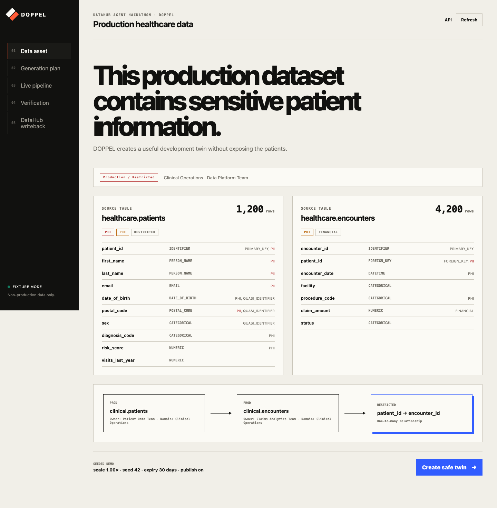
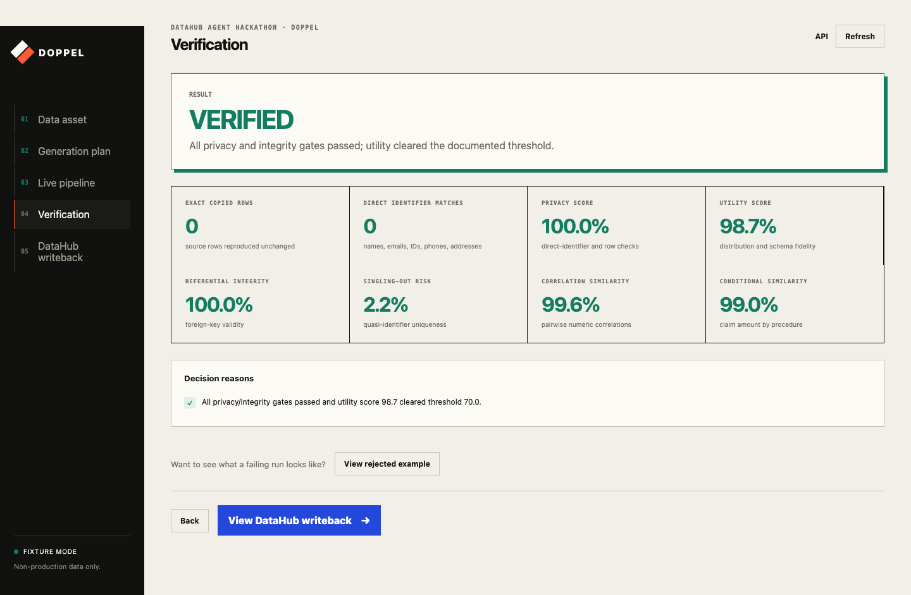
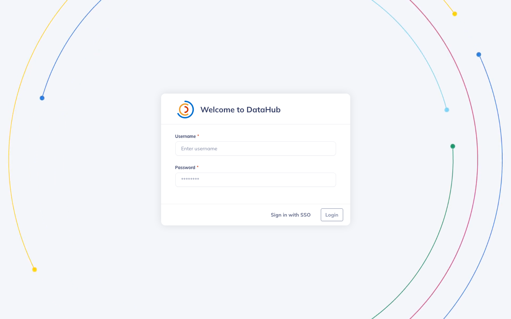
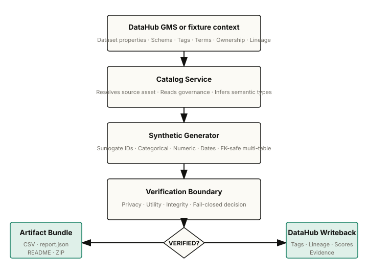

# DOPPEL

## One-sentence value proposition

**Turn governed DataHub assets into privacy-safer synthetic twins for development and testing.**

## 15-second explanation

DOPPEL reads the metadata around a sensitive dataset—schemas, tags, owners, domains, primary keys, foreign keys, and lineage—then generates a linked, non-production synthetic copy. It verifies that no direct identifiers or complete source rows leak, that relationships stay valid, and that statistical utility is preserved, then writes the result back to DataHub with lineage, tags, scores, and expiry.

## Problem

Product teams, contractors, and agents often need realistic data to build and test against. The source data usually contains direct identifiers, protected health information, financial records, or other restricted attributes. Handing over production rows exposes the organization; handing over naive fake rows breaks application logic because relationships, distributions, and correlations no longer match. Existing synthetic-data tools ignore catalog context, so they miss primary keys, foreign keys, PII tags, and ownership, and they rarely prove whether the output is safe enough to use.

## Why DataHub is essential

A normal synthetic-data script sees column names and values. DOPPEL uses DataHub as the source of truth for governance context:

- **Schema metadata** tells DOPPEL which columns exist, their types, nullability, primary keys, and foreign keys.
- **Tags and glossary terms** mark direct identifiers, quasi-identifiers, PHI, PII, and financial data.
- **Ownership and domains** determine who is accountable and which business area the twin belongs to.
- **Lineage** records where the synthetic data came from and how it relates to the source.
- **Custom properties and institutional memory** store verification scores, expiry, and the evidence report in the same catalog teams already trust.

Without DataHub, every project reinvents a fragile, hand-coded mapping. With DataHub, the twin inherits governance from the source and the result becomes a governed catalog asset itself.

## Demo

| Data asset | Verification | DataHub lineage |
|---|---|---|
|  |  |  |

The five-screen UI walks a judge through **Data Asset → Generation Plan → Live Pipeline → Verification → DataHub Writeback** in under three minutes. A one-click seeded demo uses `scale=1.00×`, `seed=42`, `expiry=30 days`, and publishes to DataHub. The resulting source-to-synthetic lineage is visible inside DataHub.

## How it works

1. **Read context.** DOPPEL resolves the source dataset from DataHub (or a checked-in fixture) and reads schemas, tags, glossary terms, ownership, domains, and relationships.
2. **Plan generation.** Every column receives a typed strategy based on its semantic type and governance tags: surrogate identifiers, synthetic names and emails, distribution-preserving dates, categorical modelling, Gaussian-copula numerics, and relationship-preserving foreign keys.
3. **Generate linked tables.** Parent tables are generated first so child foreign keys always resolve. Primary keys are replaced with non-colliding surrogates.
4. **Verify.** A fail-closed boundary checks exact-row overlap, direct-identifier overlap, quasi-identifier singling-out risk, schema fidelity, null-rate similarity, distribution similarity, correlations, conditional relationships, aggregate-query similarity, and foreign-key integrity.
5. **Write back.** A `VERIFIED` twin is registered in DataHub with `SYNTHETIC` and `NON_PRODUCTION` tags, upstream lineage, owner/domain, scores, expiry, and a linked evidence report.

## Architecture



## Read → Generate → Verify → Write-back flow

```text
DataHub GMS / fixture context
        │
        ▼
┌─────────────────┐
│  CatalogService │── schema, tags, ownership, domains, lineage
└─────────────────┘
        │
        ▼
┌───────────────────┐
│  SyntheticGenerator│── surrogate IDs, categorical/numeric/date
│                   │   generation, FK-safe multi-table output
└───────────────────┘
        │
        ▼
┌─────────────────┐
│  Evaluation     │── privacy + utility + integrity gates
└─────────────────┘
        │
        ├─► CSV + report.json + README + ZIP bundle
        │
        ▼
┌─────────────────┐
│  DataHubPublisher│── tags, lineage, properties, evidence
└─────────────────┘
```

## DataHub features used

| DataHub feature | How DOPPEL uses it |
|---|---|
| `DatasetProperties` | Description, owner, domain, and custom properties for scores/expiry |
| `SchemaMetadata` | Column names, types, nullability, primary keys, foreign keys |
| `GlobalTags` | `PII`, `PHI`, `RESTRICTED`, `QUASI_IDENTIFIER`, `FINANCIAL` |
| `GlossaryTerms` | Semantic hints that influence generation strategy |
| `Ownership` | Owner carried forward to the synthetic asset |
| `Domains` | Domain carried forward to the synthetic asset |
| `UpstreamLineage` | Source → synthetic lineage edges |
| `InstitutionalMemory` | Evidence report linked to each synthetic dataset |
| Custom properties | `privacy_score`, `utility_score`, `integrity_score`, `generated_at`, `expires_at`, `doppel_run_id` |

## Privacy methodology

DOPPEL does **not** claim formal anonymization or differential privacy. It runs transparent, fail-closed heuristics and rejects any twin that fails a gate.

- **Exact row overlap.** Every synthetic row is SHA-256 hashed after normalizing nulls and column order. Any hash that also appears in the source is a leak. A `VERIFIED` twin must have `0` overlaps.
- **Direct identifier overlap.** For columns classified as identifier, email, person name, or postal code, DOPPEL computes the set intersection of source and synthetic values. A `VERIFIED` twin must have `0` overlaps.
- **Quasi-identifier singling-out risk.** Columns tagged `QUASI_IDENTIFIER` are generalized (dates → decade, postal codes → prefix) and the fraction of synthetic rows in groups smaller than five is reported.
- **Fail-closed decision.** A twin is `REJECTED` unless the privacy score is `100.0`, integrity score is `100.0`, utility score is at least `70.0`, exact-row overlap is `0`, direct-identifier overlap is `0`, and no metric reports `fail`.

See [`docs/VERIFICATION.md`](docs/VERIFICATION.md) for full gate logic and score meanings.

## Utility methodology

Utility is measured with lightweight, deterministic metrics that compare source and synthetic distributions:

- **Schema fidelity** — column names and ordering match.
- **Null-rate similarity** — mean absolute delta between source and synthetic null rates.
- **Numeric distributions** — `1 - KS statistic` from a two-sample Kolmogorov–Smirnov test.
- **Categorical distributions** — `1 - total variation distance` between value PMFs.
- **Date/datetime distributions** — KS over parsed timestamps.
- **Correlation similarity** — pairwise Pearson correlation matrices compared.
- **Conditional relationships** — mean values per group preserved (e.g., `claim_amount` by `procedure_code`).
- **Healthcare relationships** — joint distributions of diagnosis/procedure and age-group/diagnosis compared with TVD.
- **Aggregate-query similarity** — representative queries (encounters by facility, mean claim by procedure, patients by age group) compared.
- **Cardinality preservation** — shape of children-per-parent distribution preserved after mean-normalization.

## Example verified result

```json
{
  "run_id": "6f80e4ff1c97",
  "decision": "VERIFIED",
  "privacy_score": 100.0,
  "utility_score": 98.7,
  "integrity_score": 100.0,
  "fk_integrity": 100.0,
  "exact_row_overlap": 0,
  "privacy_summary": {
    "exact_row_overlap": 0,
    "direct_identifier_overlap": 0,
    "singling_out_rate": 0.0217,
    "failed_gates": []
  },
  "utility_summary": {
    "mean_distribution_similarity": 0.9763,
    "failed_gates": []
  },
  "integrity_summary": {
    "orphan_foreign_keys": 0,
    "failed_gates": []
  },
  "synthetic_urns": [
    "urn:li:dataset:(urn:li:dataPlatform:postgres,doppel.healthcare.patients_synthetic,NON_PROD)",
    "urn:li:dataset:(urn:li:dataPlatform:postgres,doppel.healthcare.encounters_synthetic,NON_PROD)"
  ]
}
```

The full evidence report, source-to-synthetic CSVs, and DataHub mutation preview are in [`examples/`](examples/).

## Quickstart

The fastest path is fixture mode — no DataHub instance required.

```bash
# 1. Clone and enter the repository
git clone <repo-url>
cd doppel-datahub

# 2. Create a virtual environment (Python 3.11 or 3.12 recommended)
python3.12 -m venv .venv
source .venv/bin/activate

# 3. Install dependencies
pip install -r requirements-dev.txt

# 4. Run the test suite
pytest

# 5. Start the UI
uvicorn app.main:app --reload
```

Open `http://localhost:8000`, click **Create safe twin**, then **Run pipeline**.

Or use the CLI:

```bash
doppel generate --asset healthcare --scale 1 --seed 42 --expiry-days 30
```

## Local DataHub setup

To exercise the live DataHub path:

```bash
# 1. Start DataHub (requires Docker)
pip install -r requirements-datahub.txt
datahub docker quickstart

# 2. Configure DOPPEL for live mode
cp .env.example .env
# Edit .env and set DOPPEL_MODE=datahub

# 3. Bootstrap the healthcare source datasets into DataHub
python scripts/bootstrap_datahub.py

# 4. Start DOPPEL
uvicorn app.main:app --reload

# 5. Run the demo from the UI or CLI
doppel generate --asset healthcare --scale 1 --seed 42 --expiry-days 30 --publish
```

The source datasets, schemas, tags, ownership, domains, and lineage will be visible in DataHub at `http://localhost:9002`. After a run, search for `doppel` to inspect the synthetic twins.

Re-running is idempotent: DataHub aspects are overwritten, so no duplicate datasets, lineage edges, or evidence documents are created.

## Fixture-only setup

If you only want to evaluate the generation and verification engine without DataHub:

```bash
cp .env.example .env
# Ensure DOPPEL_MODE=fixture (this is the default)
pip install -r requirements-dev.txt
pytest
uvicorn app.main:app --reload
```

In fixture mode, DOPPEL reads `data/healthcare/context.json` and writes the intended DataHub mutation preview into each run artifact instead of calling GMS.

## API endpoints

| Method | Endpoint | Purpose |
|---|---|---|
| `GET` | `/api/health` | Health check and current mode |
| `GET` | `/api/assets` | List available assets |
| `GET` | `/api/assets/{id}` | Source context, row counts, and preview |
| `POST` | `/api/runs` | Generate and verify a twin |
| `POST` | `/api/runs/stream` | Stream live stage events as SSE, then return the report |
| `GET` | `/api/runs` | List prior runs |
| `GET` | `/api/runs/{id}` | Read the full evidence report |
| `POST` | `/api/runs/{id}/publish` | Emit or preview DataHub metadata mutations |
| `GET` | `/api/runs/{id}/download` | Download the complete ZIP bundle |

Interactive OpenAPI docs are available at `/docs`.

## Repository structure

```text
.
├── app/
│   ├── main.py                 # FastAPI application
│   ├── cli.py                  # doppel CLI
│   ├── config.py               # Pydantic settings
│   ├── models.py               # Pydantic domain models
│   ├── static/                 # Browser UI
│   └── services/
│       ├── catalog.py          # DataHub/fixture context loader
│       ├── synthesizer.py      # Multi-table synthetic engine
│       ├── evaluation.py       # Privacy/utility/integrity checks
│       ├── pipeline.py         # Run orchestration
│       └── datahub.py          # Live/fixture writeback
├── data/healthcare/            # Demo dataset and fixture context
├── skills/                     # Reusable DataHub Skill contribution
├── docs/                       # Architecture, demo, verification, threat model
├── examples/                   # Verified outputs, screenshots, sample reports
├── scripts/
│   ├── bootstrap_datahub.py    # Seed DataHub with the healthcare fixture
│   └── create_fixture.py       # Regenerate the local fixture dataset
├── tests/                      # Engine, API, integration, evaluation tests
├── .env.example                # Configuration template
├── Dockerfile                  # Container image
├── docker-compose.yml          # Docker Compose service
├── Makefile                    # Common commands
├── pyproject.toml              # Package metadata and tool config
├── requirements.txt            # Core dependencies
├── requirements-dev.txt        # Dev + test dependencies
├── requirements-datahub.txt    # Optional DataHub SDK
└── LICENSE                     # Apache 2.0
```

## Limitations / threat model

DOPPEL is an engineering aid, not a legal anonymization system.

- **Not differential privacy.** An attacker with outside knowledge may still make inferences.
- **Not a legal compliance certification.** Always involve privacy review before sharing outputs.
- **Not a bound on membership inference.** The checks detect obvious leakage, not sophisticated model-based attacks.
- **Not production-safe by default.** Outputs are tagged `SYNTHETIC` and `NON_PRODUCTION` and carry an expiry.
- **Environment-dependent.** Live DataHub reads/writes require a reachable GMS and a compatible `acryl-datahub` version.

See [`docs/THREAT_MODEL.md`](docs/THREAT_MODEL.md) for the full threat model and controls.

## Future work

- Differential-privacy or k-anonymity options for stricter privacy models.
- Additional source-system connectors beyond CSV/PostgreSQL-style datasets.
- Retention enforcement that deletes expired artifact directories automatically.
- Row-level access control and audit logging for artifact downloads.
- Multi-agent review workflow that separates generation, verification, and approval into distinct steps.
- Integration with DataHub assertions and quality signals to drive generation parameters.

## Apache 2.0 license

Apache License 2.0. See [LICENSE](LICENSE).
